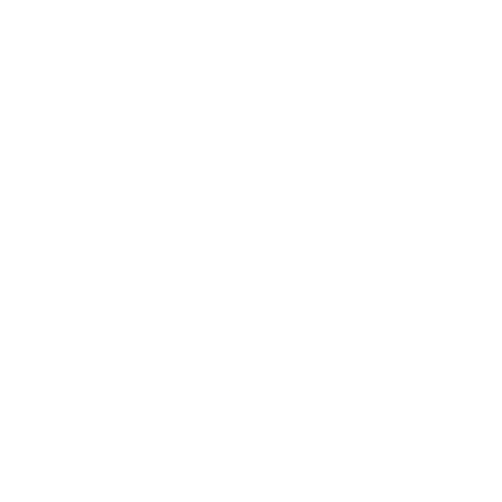

<div align="center">



# Stukje Notes

**Just enough app to write things down.**

A simple, elegant, monochrome note-taking app for desktop. No accounts, no cloud, no clutter.


</div>

---

## ✨ Features

- 📝 **Quick notes**: title + body, nothing more
- 💾 **Auto-save**: saves as you type
- 🔍 **Instant search**: filter your notes in the sidebar
- 🕒 **Sorted by last edited**: your latest notes are always on top
- 📤 **Export to TXT**: share any note as a plain text file
- 🗑️ **Safe delete**: confirmation before anything is removed
- ⌨️ **Shortcuts**: `Ctrl/Cmd + S` to save, `Tab` to indent

## 📥 Download & Install (Windows)

1. Go to the [**Releases**](../../releases/latest) page.
2. Download `Stukje Notes Setup x.x.x.exe`.
3. Run it, choose **where you want to install it**, and click Install.

> Windows SmartScreen may warn about an unknown publisher since the app isn't code-signed. Click **More info → Run anyway**.

## 🔒 Your notes are yours

Notes are stored locally as `.stukje` files (JSON inside) in:

```
~/StukjeNotes/      (e.g. C:\Users\<you>\StukjeNotes)
```

Nothing ever leaves your computer. Uninstalling the app does not delete your notes, and you can back them up by copying that folder.

## 🛠️ Build from source

Requires [Node.js](https://nodejs.org/) v18+.

```bash
git clone https://github.com/dmrss04/STUKJE-NOTES.git
cd STUKJE-NOTES
npm install
npm start          # run the app
npm run dist       # build the Windows installer into /dist
```

## 📁 Project structure

```
stukje-notes/
├── package.json
└── src/
    ├── main.js       ← Electron main process
    ├── preload.js    ← Context bridge (IPC)
    └── index.html    ← Full UI (HTML/CSS/JS)
```

## 📄 License

[MIT](LICENSE)

---

*stukje* is Dutch for "small piece" or "little bit".
